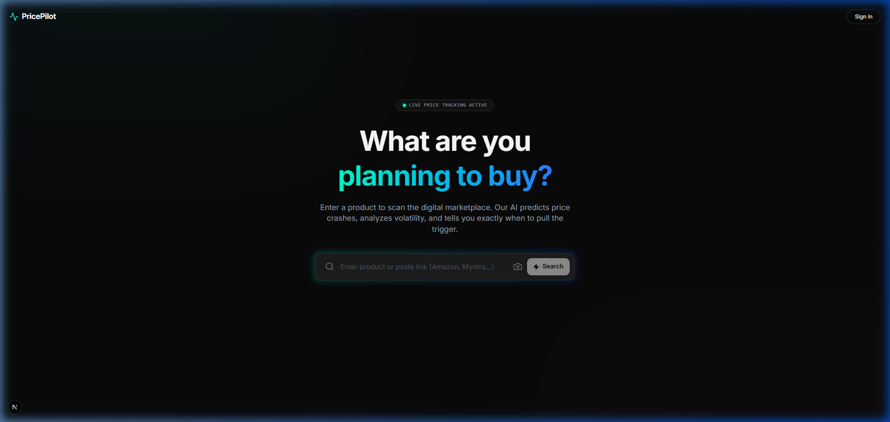
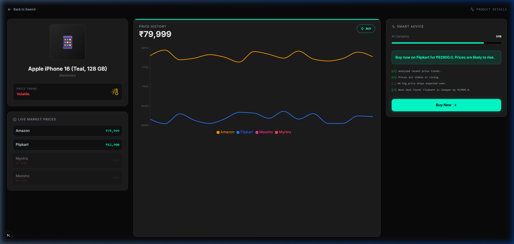

#  PricePilot: Your AI-Powered Shopping OS

**PricePilot** isn't just another price tracker—it's a mission control center for your wallet. It scans the digital marketplace in real-time, predicts future price crashes using AI, and tells you exactly when to "Pull the Trigger" on a purchase or "Hold the Line."
Check the best one!!
---

##  The Mission (Why we built this)
In today's market, prices change by the hour. Checking Amazon, then Flipkart, then Myntra, and then Meesho manually is exhausting. We built PricePilot to automate that fatigue. 

Most trackers only show you *what* the price is. PricePilot uses Machine Learning to tell you *what the price will be*, helping you avoid "Buyer's Remorse" forever.

---

##  What’s Under the Hood? (How it works)

### 1. The Stealth Scraper
We use **Playwright** to orchestrate a fleet of headless browsers. Unlike simple bots, our scraper mirrors human behavior to bypass aggressive anti-bot protections on major Indian retailers (Amazon, Flipkart, Myntra, Meesho).

### 2. The AI Vision & URL Engine
- **Image Search:** Upload a product photo, and our identification logic extracts the item name to begin a cross-platform scan.
- **Direct Link Parsing:** Paste any product URL. The engine visits the site, identifies the product via OpenGraph metadata, and finds matches across all other competitors.

### 3. Predictive Intelligence (ML)
Using **Scikit-Learn (Linear Regression)**, the app analyzes historical price volatility. It calculates the "Confidence Score" of a deal and predicts the potential savings you could gain by waiting just a few more days.

---

##  Tech Stack
- **Frontend:** Next.js (React), TailwindCSS, Recharts (Cinematic Data Viz), Framer Motion.
- **Backend:** FastAPI (Python), SQLAlchemy ORM, Playwright (Automation).
- **Database:** PostgreSQL (Historical Tracking).
- **AI:** Scikit-Learn (Regression Models).

---

##  Visual Showcase

### 1. The Radar Entry (Home Page)
The search interface with real-time "Live Price Tracking" status.


### 2. Multi-App Battle & Cinematic Graph
A side-by-side comparison of Amazon, Flipkart, Myntra, and Meesho, paired with our multi-line historical trend chart.


### 3. The AI Verdict
A focused view of the Smart Advice panel showing the AI's recommendation, certainty score, and logical reasoning.

---

## 🚢 How to Launch
### Terminal 1: The Brain (Backend)
```powershell
cd backend
.\venv\Scripts\activate
python main.py
```

### Terminal 2: The Interface (Frontend)
```powershell
cd frontend
npm run dev
```
Visit: `http://localhost:3000`

---

##  What we accomplished
During this build, we tackled several hard engineering challenges:
- **Resilient Scraping:** Moving from brittle requests to a robust browser-based automation system.
- **Multi-Platform Sync:** Architecting a database that can track 4 different apps' histories simultaneously on a single graph.
- **Premium UX:** Crafting a "Glassmorphic" UI that feels like a high-tech radar system rather than a generic e-commerce site.

---
*Built for smarter shopping.*

*Aishwarya Rangu*


